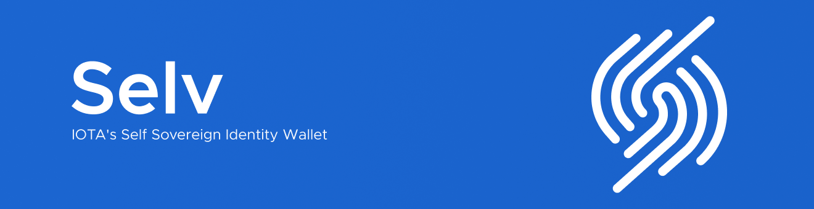

<p align="center">
  <a href="https://discord.iota.org/" style="text-decoration:none;"></a>
  <a href="https://iota.stackexchange.com/" style="text-decoration:none;"></a>
  <a href="https://github.com/iotaledger/identity.rs/blob/master/LICENSE" style="text-decoration:none;"></a>
</p>

⚠ Please note that this branch won't work for the official Selv experiences, since this branch holds the new and improved version of the Selv mobile app. For an app that is compatible with the offical Selv experiences please refer to the [main branch](https://github.com/iotaledger/selv-mobile/tree/main).

## Run in development mode

#### 1. Install Node.JS

First you need to install [Node.JS](https://nodejs.org) if you haven’t done that already.

#### 2. Install Yarn

Install [Yarn](https://yarnpkg.com/) Node.js dependency manager:

```
curl -o- -L https://yarnpkg.com/install.sh | bash
```

#### 3. Clone repository

Clone repository by running:

```
git clone https://github.com/iotaledger/selv-mobile.git
```

#### 4. Install dependencies

To install the dependencies, run:

```
yarn
```

#### 5. Run in development mode

To run the application locally, run:

```
yarn web
```

and open `http://localhost:3001` in your favourite browser.

## Build appliciation

To build application for iOS or android, some additional [dependencies](https://capacitor.ionicframework.com/docs/getting-started/dependencies) need to be installed.

To start the build process, run `yarn ios` or `yarn android`.

## How to add custom credentials

This chapter will guide you through the process of adding your own credential types to the Selv-App.

### Add Credential Schemas

Add your JSON-Schemas to `ui/lib/identity/schemas/index`.

### Add DID Mapping

You can enrich the display of credentials and presentations by adding enrichments to `ui/lib/identity/schemas/index`.

You can supply overrides for:

-   issuerLabel: as a string
-   logo: as a string pointing to a file (see the next paragraph)
-   theme: as a HEX string like `#FF0000`

Add your logo files to `ui/assets` TODO: Dimensions / Format
Setup a mapping between the logo id and the path in TBD

### Generate Credentials

You can use the included CLI to generate a credential. Supply the name of schema as defined in "Add Credential Schemas" and a path to your input data.

`yarn cli SCHEMANAME path/to/data.json`

The CLI will generate a QR-Code encoding the new credential at `.cli/credential.svg`, which you can scan in the app.

### Accept Credentials

Scan the generated QR-Code from the previous step in the App to store it.

### Verify Credentials

You can present your stored credentials to another Selv-User to validate it in their app.
